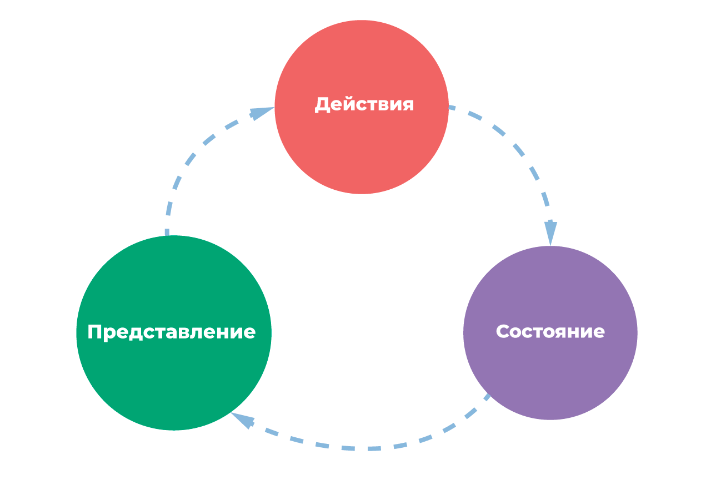

# Vuex start

Basics Vue & Vuex sample

- [Demo Frontend](https://vuex-start.vercel.app)
- [JSON Server](https://stream-json-server.herokuapp.com)

---

## Project setup

```
yarn install
```

### Compiles and hot-reloads for development

```
yarn dev
yarn serve
```

App running at:

- Local: [localhost:8080/](http://localhost:8080/)
- Network: [192.168.1.103:8080/](http://192.168.1.103:8080/)

### Compiles and minifies for production

```
yarn build
```

### Lints and fixes files

```
yarn lint
```

### Customize configuration

See [Configuration Reference](https://cli.vuejs.org/config/).
[Vuex?](https://vuex.vuejs.org/ru/#что-такое-«паттерн-управления-состоянием»)




